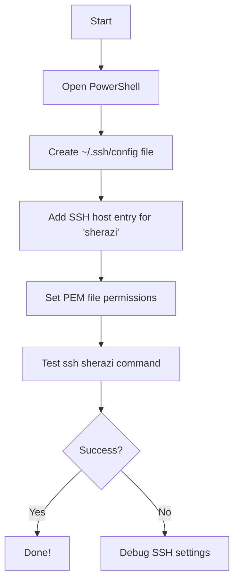

# SSH Shortcut to AWS EC2 Instance on Windows 11


## This guide helps you set up a one-word SSH shortcut (e.g., `sherazi`) to connect to your AWS EC2 instance using PowerShell on Windows 11.
### Note that I'm using AWS EC2 instance just for a guidance, you can apply this knowledge on any server of your choice - you're not limited to AWS EC2!
---

## 🛠️ Requirements
- Windows 11
- PowerShell
- AWS EC2 instance with a `.pem` key
- Your key file (e.g., `key-aws.pem`) must be saved locally

---

## 🔑 Assumptions
- Key file path: `C:\Users\hsherazi\key-aws.pem`
- EC2 username: `ubuntu` (or `ec2-user` for Amazon Linux)
- EC2 public IP: `YOUR.EC2.IP.ADDRESS`
- Desired shortcut command: `sherazi`

---

## 🧭 Step-by-Step Guide

### Step 1: Create an SSH config file

1. Open PowerShell
2. Create SSH config directory if it doesn't exist:

```powershell
mkdir $HOME\.ssh
```

3. Open the SSH config file in Notepad:

```powershell
notepad $HOME\.ssh\config
```

4. Add the following content to the file:

```text
Host sherazi
    HostName YOUR.EC2.IP.ADDRESS
    User ubuntu
    IdentityFile C:/Users/hsherazi/key-aws.pem
    IdentitiesOnly yes
```

🔁 Replace `YOUR.EC2.IP.ADDRESS` with the actual public IP of your EC2 instance.

5. Save and close the file.

### Step 2: Set proper file permissions

1. Open PowerShell as Administrator
2. Run this command to remove all other users' permissions:

```powershell
icacls "C:\Users\hsherazi\key-aws.pem" /inheritance:r /grant:r hsherazi:R
```

### Step 3: Test your SSH shortcut

```powershell
ssh sherazi
```

You should now be logged into your EC2 instance.

---

## 🧠 Optional: Add PowerShell Alias (Alternative)
If you'd rather alias `ssh sherazi` to just `sherazi`:

1. Edit your PowerShell profile:

```powershell
notepad $PROFILE
```

2. Add the following line:

```powershell
Set-Alias sherazi "ssh" -Option AllScope
function sherazi { ssh sherazi }
```

3. Restart PowerShell and run:

```powershell
sherazi
```

---

## 📊 Flowchart



---

## ✅ Summary
You can now connect to your EC2 instance by typing just:

```powershell
sherazi
```

This works via SSH config or an alias. Let PowerShell do the heavy lifting for you!

