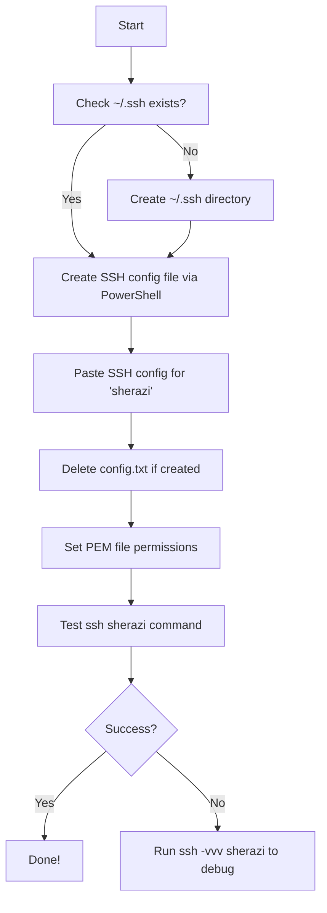

# SSH Shortcut to AWS EC2 Instance on Windows 11


##### This guide helps you set up a one-word SSH shortcut (e.g., `sherazi`) to connect to your AWS EC2 instance using PowerShell on Windows 11. Note that I'm using AWS EC2 instance just for the guidance, you can apply this knowledge on any server of your choice - you're not limited to AWS EC2!
---


## 🛠️ Requirements

* Windows 11
* PowerShell
* AWS EC2 instance with a `.pem` key
* Your key file (e.g., `aws-key.pem`) must be saved locally

---

## 🔑 Assumptions

* Key file path: `C:\Users\hsherazi\aws-key.pem`
* EC2 username: `ubuntu` (or `ec2-user` for Amazon Linux)
* EC2 public IP: `YOUR.EC2.IP.ADDRESS`
* Desired shortcut command: `sherazi`

---

## 🧭 Step-by-Step Guide

### Step 1: Check for SSH directory

1. Open PowerShell
2. Run this command to check if `.ssh` exists:

```powershell
Test-Path $HOME\.ssh
```

3. If it returns `False`, create it:

```powershell
mkdir $HOME\.ssh
```

### Step 2: Create or fix the SSH config file

#### 🔥 Avoid the Notepad Trap: Use PowerShell

Windows Notepad tends to save files as `.txt`. To create the correct `config` file:

1. Run this to create the file with no extension:

```powershell
New-Item -Path $HOME\.ssh\config -ItemType File -Force
```

2. Now open it with Notepad:

```powershell
notepad $HOME\.ssh\config
```

3. Paste the following content:

```text
Host sherazi
    HostName YOUR.EC2.IP.ADDRESS
    User ubuntu
    IdentityFile C:/Users/hsherazi/aws-key.pem
    IdentitiesOnly yes
```

🔁 Replace `YOUR.EC2.IP.ADDRESS` with the actual public IP of your EC2 instance.

4. Save and close the file.

#### 🧽 Delete wrong config.txt file if it was created

```powershell
Remove-Item $HOME\.ssh\config.txt
```

### Step 3: Set proper file permissions

1. Open PowerShell as Administrator
2. Run this command to remove all other users' permissions:

```powershell
icacls "C:\Users\hsherazi\aws-key.pem" /inheritance:r /grant:r hsherazi:R
```

### Step 4: Test your SSH shortcut

```powershell
ssh sherazi
```

You should now be logged into your EC2 instance.

🧪 If it fails, try:

```powershell
ssh -vvv sherazi
```

This will show debug output to help identify the issue.

---

## 🧠 Optional: Add PowerShell Alias (Alternative)

If you'd rather alias `ssh sherazi` to just `sherazi`:

### Step 1: Create Your PowerShell Profile (if it doesn't exist)

```powershell
New-Item -Path $PROFILE -ItemType File -Force
```

### Step 2: Edit the Profile

```powershell
notepad $PROFILE
```

### Step 3: Add the Alias Function

Paste the following into the profile file:

```powershell
function Start-SheraziSSH {
    ssh sherazi
}

Set-Alias sherazi Start-SheraziSSH -Option AllScope
```

### Step 4: Reload the Profile or Restart PowerShell

```powershell
. $PROFILE
```

Then run:

```powershell
sherazi
```

---

## 📊 Flowchart



---

## ✅ Summary

You can now connect to your EC2 instance by typing just:

```powershell
sherazi
```

This works via SSH config or an alias. Let PowerShell do the heavy lifting for you!
